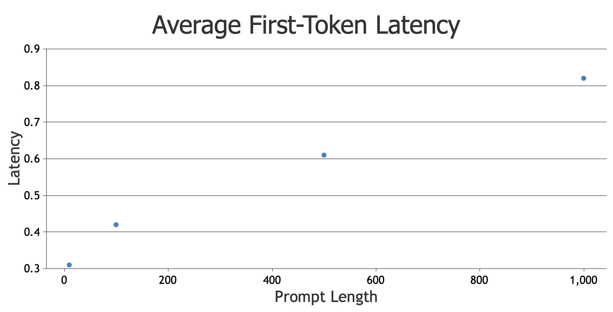

<!--
Copyright (c) 2023, NVIDIA CORPORATION & AFFILIATES. All rights reserved.

Redistribution and use in source and binary forms, with or without
modification, are permitted provided that the following conditions
are met:
 * Redistributions of source code must retain the above copyright
   notice, this list of conditions and the following disclaimer.
 * Redistributions in binary form must reproduce the above copyright
   notice, this list of conditions and the following disclaimer in the
   documentation and/or other materials provided with the distribution.
 * Neither the name of NVIDIA CORPORATION nor the names of its
   contributors may be used to endorse or promote products derived
   from this software without specific prior written permission.

THIS SOFTWARE IS PROVIDED BY THE COPYRIGHT HOLDERS ``AS IS'' AND ANY
EXPRESS OR IMPLIED WARRANTIES, INCLUDING, BUT NOT LIMITED TO, THE
IMPLIED WARRANTIES OF MERCHANTABILITY AND FITNESS FOR A PARTICULAR
PURPOSE ARE DISCLAIMED.  IN NO EVENT SHALL THE COPYRIGHT OWNER OR
CONTRIBUTORS BE LIABLE FOR ANY DIRECT, INDIRECT, INCIDENTAL, SPECIAL,
EXEMPLARY, OR CONSEQUENTIAL DAMAGES (INCLUDING, BUT NOT LIMITED TO,
PROCUREMENT OF SUBSTITUTE GOODS OR SERVICES; LOSS OF USE, DATA, OR
PROFITS; OR BUSINESS INTERRUPTION) HOWEVER CAUSED AND ON ANY THEORY
OF LIABILITY, WHETHER IN CONTRACT, STRICT LIABILITY, OR TORT
(INCLUDING NEGLIGENCE OR OTHERWISE) ARISING IN ANY WAY OUT OF THE USE
OF THIS SOFTWARE, EVEN IF ADVISED OF THE POSSIBILITY OF SUCH DAMAGE.
-->

# Benchmarking LLM

> **Note**
> 
> These benchmarks currently only work with Perf Analyzer built from the latest
> `main` branch. See
> [build from source instructions](install.md#build-from-source). If you are using
> Perf Analyzer from the Triton SDK container (e.g.
> `nvcr.io/nvidia/tritonserver:<xx.yy>-py3-sdk`), you **will need to wait until the
> `23.09` container is released to perform the steps in this guide**.

The following guide shows the reader how to use Triton
[Perf Analyzer](https://github.com/triton-inference-server/client/tree/main/src/c%2B%2B/perf_analyzer)
to measure and characterize the performance behaviors of Large Language Models
(LLMs) using Triton with [vLLM](https://github.com/vllm-project/vllm).

### Setup: Download and configure Triton Server environment

From [Step 1 of the Triton vLLM tutorial](https://github.com/triton-inference-server/tutorials/blob/main/Quick_Deploy/vLLM/README.md#step-1-build-a-triton-container-image-with-vllm).

```bash
git clone https://github.com/triton-inference-server/tutorials
cd tutorials/Quick_Deploy/vLLM
docker build -t tritonserver_vllm .
# wait for command to finish, might take several minutes
```

### Benchmark 1: Profiling the Prefill Phase

In this benchmarking scenario, we want to measure the effect of input prompt
size on first-token latency. We issue single request to the server of fixed
input sizes and request the model to compute at most one new token. This
essentially means one pass through the model.

#### 1. Run the following commands to set `max_tokens` to `1`

```bash
# in the `tutorials/Quick_Deploy/vLLM` directory from above
PATH_TO_MODEL_PY="model_repository/vllm/1/model.py"
MAX_TOKENS=1
sed -i "128s/.*/\ \ \ \ \ \ \ \ params_dict[\"max_tokens\"] = ${MAX_TOKENS}/" ${PATH_TO_MODEL_PY}
```

#### 2. Start Triton Server

```bash
docker run --gpus all -it --rm -p 8001:8001 --shm-size=1G --ulimit memlock=-1 --ulimit stack=67108864 -v ${PWD}:/work -w /work tritonserver_vllm tritonserver --model-store ./model_repository
# this will run continuously in the current shell
```

#### 3. Generate prompts input data JSON

```bash
# open a new shell in the same directory you were in when running the above command
echo '
{
    "data": [
        {
            "PROMPT": [
                "Hello, my name is"
            ],
            "STREAM": [
                true
            ]
        }
    ]
}
' > prompts.json
```

#### 4. Run Perf Analyzer

```bash
perf_analyzer \
    -m vllm \
    -i grpc \
    --async \
    --streaming \
    --input-data=prompts.json \
    --profile-export-file=profile_export.json \
    --measurement-mode=count_windows \
    --measurement-request-count=10 \
    --stability-percentage=999
```

#### 5. Calculate average first-token latency

```bash
python3 examples/calculate_avg_first_token_latency.py
# Average first-token latency: 0.3065654714375 s
```

#### 6. Repeat steps 3-5 with different prompt lengths to measure effects of initial prompt size (prefill) on first-token latency.

For example:


### Benchmark 2: Profiling the Generation Phase

In this benchmarking scenario, we want to measure the effect of input prompt
size on token-to-token latency. We issue single request to the server of fixed
input sizes and request the model to compute a fixed amount of tokens.

#### (Optional) Stop Triton Server if already running

```bash
pkill tritonserver
```

#### 1. Run the following commands to set the `max_tokens` to `256` and `ignore_eos` to `true`

```bash
PATH_TO_MODEL_PY="model_repository/vllm/1/model.py"
MAX_TOKENS=256
sed -i "128s/.*/\ \ \ \ \ \ \ \ params_dict[\"max_tokens\"] = ${MAX_TOKENS}/" ${PATH_TO_MODEL_PY}
sed -i "128i\ \ \ \ \ \ \ \ params_dict[\"ignore_eos\"] = True" ${PATH_TO_MODEL_PY}
```

#### 2. Start Triton Server

```bash
docker run --gpus all -it --rm -p 8001:8001 --shm-size=1G --ulimit memlock=-1 --ulimit stack=67108864 -v ${PWD}:/work -w /work tritonserver_vllm tritonserver --model-store ./model_repository
# this will run continuously in the current shell
```

#### 3. Generate prompts input data JSON

```bash
# open a new shell in the same directory you were in when running the above command
echo '
{
    "data": [
        {
            "PROMPT": [
                "Hello, my name is"
            ],
            "STREAM": [
                true
            ]
        }
    ]
}
' > prompts.json
```

#### 4. Run Perf Analyzer

```bash
perf_analyzer \
    -m vllm \
    -i grpc \
    --async \
    --streaming \
    --input-data=prompts.json \
    --profile-export-file=profile_export.json \
    --measurement-mode=count_windows \
    --measurement-request-count=10 \
    --stability-percentage=999
```

#### 5. Calculate average token-to-token latency

```bash
python3 examples/calculate_avg_token_to_token_latency.py
# Average token-to-token latency: 0.003090155677419355 s
```

#### 6. Repeat steps 3-5 with different prompt lengths to measure effects of initial prompt size (prefill) on token-to-token latency (generation).
