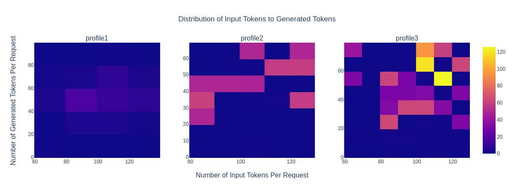
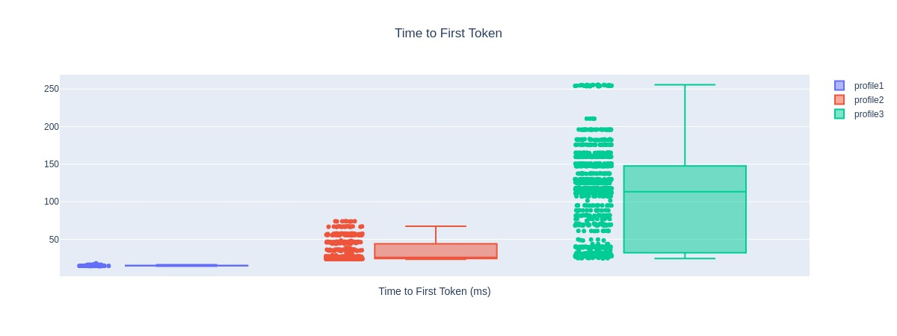
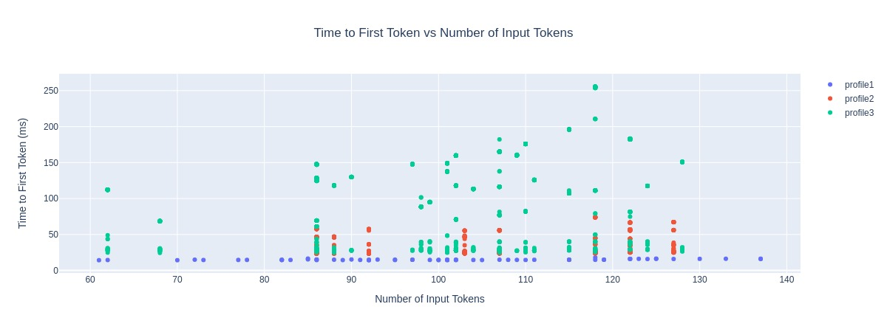
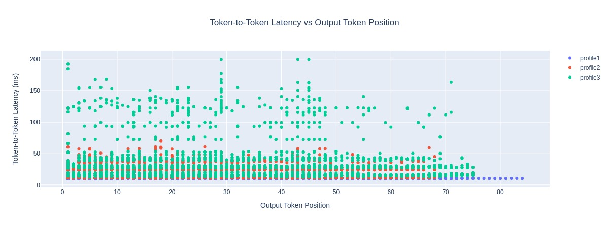

<!--
Copyright (c) 2024, NVIDIA CORPORATION & AFFILIATES. All rights reserved.

Redistribution and use in source and binary forms, with or without
modification, are permitted provided that the following conditions
are met:
 * Redistributions of source code must retain the above copyright
   notice, this list of conditions and the following disclaimer.
 * Redistributions in binary form must reproduce the above copyright
   notice, this list of conditions and the following disclaimer in the
   documentation and/or other materials provided with the distribution.
 * Neither the name of NVIDIA CORPORATION nor the names of its
   contributors may be used to endorse or promote products derived
   from this software without specific prior written permission.

THIS SOFTWARE IS PROVIDED BY THE COPYRIGHT HOLDERS ``AS IS'' AND ANY
EXPRESS OR IMPLIED WARRANTIES, INCLUDING, BUT NOT LIMITED TO, THE
IMPLIED WARRANTIES OF MERCHANTABILITY AND FITNESS FOR A PARTICULAR
PURPOSE ARE DISCLAIMED.  IN NO EVENT SHALL THE COPYRIGHT OWNER OR
CONTRIBUTORS BE LIABLE FOR ANY DIRECT, INDIRECT, INCIDENTAL, SPECIAL,
EXEMPLARY, OR CONSEQUENTIAL DAMAGES (INCLUDING, BUT NOT LIMITED TO,
PROCUREMENT OF SUBSTITUTE GOODS OR SERVICES; LOSS OF USE, DATA, OR
PROFITS; OR BUSINESS INTERRUPTION) HOWEVER CAUSED AND ON ANY THEORY
OF LIABILITY, WHETHER IN CONTRACT, STRICT LIABILITY, OR TORT
(INCLUDING NEGLIGENCE OR OTHERWISE) ARISING IN ANY WAY OUT OF THE USE
OF THIS SOFTWARE, EVEN IF ADVISED OF THE POSSIBILITY OF SUCH DAMAGE.
-->

# GenAI-Perf Compare Subcommand

There are two approaches for the users to use the `compare` subcommand to create
plots across multiple runs. First is to directly pass the profile export files
with `--files` option

## Running initially with `--files` option

If the user does not have a YAML configuration file,
they can run the `compare` subcommand with the `--files` option to generate a
set of default plots as well as a pre-filled YAML config file for the plots.

```bash
genai-perf compare --files profile1.json profile2.json profile3.json
```

This will generate the default plots and compare across the three runs.
GenAI-Perf will also generate an initial YAML configuration file `config.yaml`
that is pre-filled with plot configurations as following:

```yaml
plot1:
  title: Time to First Token
  x_metric: ''
  y_metric: time_to_first_tokens
  x_label: Time to First Token (ms)
  y_label: ''
  width: 1200
  height: 700
  type: box
  paths:
  - profile1.json
  - profile2.json
  - profile3.json
  output: compare
plot2:
  title: Request Latency
  x_metric: ''
  y_metric: request_latencies
  x_label: Request Latency (ms)
  y_label: ''
  width: 1200
  height: 700
  type: box
  paths:
  - profile1.json
  - profile2.json
  - profile3.json
  output: compare
plot3:
  title: Distribution of Input Tokens to Generated Tokens
  x_metric: num_input_tokens
  y_metric: num_output_tokens
  x_label: Number of Input Tokens Per Request
  y_label: Number of Generated Tokens Per Request
  width: 1200
  height: 450
  type: heatmap
  paths:
  - profile1.json
  - profile2.json
  - profile3.json
  output: compare
plot4:
  title: Time to First Token vs Number of Input Tokens
  x_metric: num_input_tokens
  y_metric: time_to_first_tokens
  x_label: Number of Input Tokens
  y_label: Time to First Token (ms)
  width: 1200
  height: 700
  type: scatter
  paths:
  - profile1.json
  - profile2.json
  - profile3.json
  output: compare
plot5:
  title: Token-to-Token Latency vs Output Token Position
  x_metric: token_positions
  y_metric: inter_token_latencies
  x_label: Output Token Position
  y_label: Token-to-Token Latency (ms)
  width: 1200
  height: 700
  type: scatter
  paths:
  - profile1.json
  - profile2.json
  - profile3.json
  output: compare
```

Once the user has the YAML configuration file,
they can repeat the process of editing the config file and running with
`--config` option to re-generate the plots iteratively.

```bash
# edit
vi config.yaml

# re-generate the plots
genai-perf compare --config config.yaml
```

## Running directly with `--config` option

If the user would like to create a custom plot (other than the default ones provided),
they can build their own YAML configuration file that contains the information
about the plots they would like to generate.
For instance, if the user would like to see how the inter token latencies change
by the number of output tokens, which is not part of the default plots,
they could add the following YAML block to the file:

```yaml
plot1:
  title: Inter Token Latency vs Output Tokens
  x_metric: num_output_tokens
  y_metric: inter_token_latencies
  x_label: Num Output Tokens
  y_label: Avg ITL (ms)
  width: 1200
  height: 450
  type: scatter
  paths:
    - <path-to-profile-export-file>
    - <path-to-profile-export-file>
  output: compare
```

After adding the lines, the user can run the following command to generate the
plots specified in the configuration file (in this case, `config.yaml`):

```bash
genai-perf compare --config config.yaml
```

The user can check the generated plots under the output directory:
```
compare/
├── inter_token_latency_vs_output_tokens.jpeg
└── ...
```

## YAML Schema

Here are more details about the YAML configuration file and its stricture.
The general YAML schema for the plot configuration looks as following:

```yaml
plot1:
  title: [str]
  x_metric: [str]
  y_metric: [str]
  x_label: [str]
  y_label: [str]
  width: [int]
  height: [int]
  type: [scatter,box,heatmap]
  paths:
    - [str]
    - ...
  output: [str]

plot2:
  title: [str]
  x_metric: [str]
  y_metric: [str]
  x_label: [str]
  y_label: [str]
  width: [int]
  height: [int]
  type: [scatter,box,heatmap]
  paths:
    - [str]
    - ...
  output: [str]

# add more plots
```

The user can add as many plots they would like to generate by adding the plot
blocks in the configuration file (they have a key pattern of `plot<#>`,
but that is not required and the user can set it to any arbitrary string).
For each plot block, the user can specify the following configurations:
- `title`: The title of the plot.
- `x_metric`: The name of the metric to be used on the x-axis.
- `y_metric`: The name of the metric to be used on the y-axis.
- `x_label`: The x-axis label (or description)
- `y_label`: The y-axis label (or description)
- `width`: The width of the entire plot
- `height`: The height of the entire plot
- `type`: The type of the plot. It must be one of the three: `scatter`, `box`,
or `heatmap`.
- `paths`: List of paths to the profile export files to compare.
- `output`: The path to the output directory to store all the plots and YAML
configuration file.

> [!Note]
> User *MUST* provide at least one valid path to the profile export file.


## Example Plots

Here are the list of sample plots that gets created by default from running the
`compare` subcommand:

### Distribution of Input Tokens to Generated Tokens


### Request Latency Analysis


### Time to First Token Analysis


### Time to First Token vs. Number of Input Tokens


### Token-to-Token Latency vs. Output Token Position


