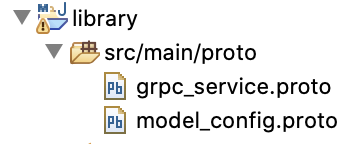
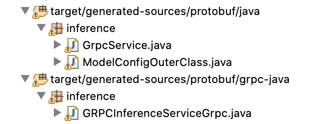

<!--
# Copyright (c) 2021, NVIDIA CORPORATION & AFFILIATES. All rights reserved.
#
# Redistribution and use in source and binary forms, with or without
# modification, are permitted provided that the following conditions
# are met:
#  * Redistributions of source code must retain the above copyright
#    notice, this list of conditions and the following disclaimer.
#  * Redistributions in binary form must reproduce the above copyright
#    notice, this list of conditions and the following disclaimer in the
#    documentation and/or other materials provided with the distribution.
#  * Neither the name of NVIDIA CORPORATION nor the names of its
#    contributors may be used to endorse or promote products derived
#    from this software without specific prior written permission.
#
# THIS SOFTWARE IS PROVIDED BY THE COPYRIGHT HOLDERS ``AS IS'' AND ANY
# EXPRESS OR IMPLIED WARRANTIES, INCLUDING, BUT NOT LIMITED TO, THE
# IMPLIED WARRANTIES OF MERCHANTABILITY AND FITNESS FOR A PARTICULAR
# PURPOSE ARE DISCLAIMED.  IN NO EVENT SHALL THE COPYRIGHT OWNER OR
# CONTRIBUTORS BE LIABLE FOR ANY DIRECT, INDIRECT, INCIDENTAL, SPECIAL,
# EXEMPLARY, OR CONSEQUENTIAL DAMAGES (INCLUDING, BUT NOT LIMITED TO,
# PROCUREMENT OF SUBSTITUTE GOODS OR SERVICES; LOSS OF USE, DATA, OR
# PROFITS; OR BUSINESS INTERRUPTION) HOWEVER CAUSED AND ON ANY THEORY
# OF LIABILITY, WHETHER IN CONTRACT, STRICT LIABILITY, OR TORT
# (INCLUDING NEGLIGENCE OR OTHERWISE) ARISING IN ANY WAY OUT OF THE USE
# OF THIS SOFTWARE, EVEN IF ADVISED OF THE POSSIBILITY OF SUCH DAMAGE.
-->

[](https://opensource.org/licenses/BSD-3-Clause)

# Example Java and Scala client Using Generated GRPC API


## Prerequsites
Maven 3.3+ and JDK 1.8+

## Generating java GRPC client stub

Clone the [triton-inference-server/common](https://github.com/triton-inference-server/common/)
repository:

```
git clone https://github.com/triton-inference-server/common/ -b <common-repo-branch> common-repo
```

\<common-repo-branch\> should be the version of the Triton server that you
intend to use (e.g. r21.05).

Copy __*.proto__ files to Library src/main/proto

```
$ cd library
$ cp ../common-repo/protobuf/*.proto src/main/proto/
```

After copying the protobuf files, the __library__ dir should look as below.




```
$ mvn compile
```
Once compiled, one should notice the generated *.java files under __target__ folder



## Use the generated files in any project

To run the examples clients, copy the above generated stub into __examples__ folder

```
$ cd ..

$ cp -R library/target/generated-sources/protobuf/java/inference  examples/src/main/java/inference

$ cp -R library/target/generated-sources/protobuf/grpc-java/inference/*.java  examples/src/main/java/inference/

```
See the __examples__ project which has __scala__ and __java__ sample client. 

## Running java example client 

```
$ cd examples

$ mvn clean install 

$ mvn exec:java -Dexec.mainClass=clients.SimpleJavaClient -Dexec.args="<host> <port>"
```

__host__  where triton inference server is running

__port__ default grpc port is 8001

## Running scala example client 

```
$ mvn exec:java -Dexec.mainClass=clients.SimpleClient -Dexec.args="<host> <port>"
```

Both the examples run inference with respect to __simple__ model. The __scala__ example is more comprehensive and checks APIs like server ready and model ready

### Output of the scala client once run succesfully

```
name: "OUTPUT0"
datatype: "INT32"
shape: 1
shape: 16

name: "OUTPUT1"
datatype: "INT32"
shape: 1
shape: 16

1 + 1 = 2
1 - 1 = 0
2 + 2 = 4
2 - 2 = 0
3 + 3 = 6
3 - 3 = 0
4 + 4 = 8
4 - 4 = 0
5 + 5 = 10
5 - 5 = 0
6 + 6 = 12
6 - 6 = 0
7 + 7 = 14
7 - 7 = 0
8 + 8 = 16
8 - 8 = 0
9 + 9 = 18
9 - 9 = 0
10 + 10 = 20
10 - 10 = 0
11 + 11 = 22
11 - 11 = 0
12 + 12 = 24
12 - 12 = 0
13 + 13 = 26
13 - 13 = 0
14 + 14 = 28
14 - 14 = 0
15 + 15 = 30
15 - 15 = 0
16 + 16 = 32
16 - 16 = 0
```
